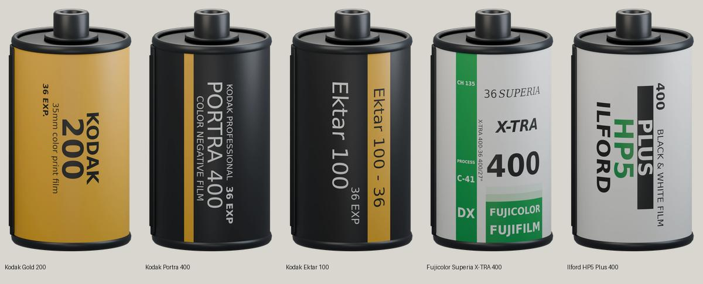

# Image-derived cartridge examples

The five label layouts were revised from photos verified to show the actual 135 canister, not inferred from retail boxes or lifestyle imagery. Each example follows its own pictured edition; where a product has multiple packaging generations, the cited photo defines the version reconstructed. The renders are original interpretations, not licensed artwork or exact replicas.

| Example | Verified canister reference |
| --- | --- |
| [Kodak Gold 200](kodak-gold-200.json) | [Actual Kodak Gold 200 135 canister](https://commons.wikimedia.org/wiki/File:Kodak-gold-200.jpg) |
| [Kodak Portra 400](kodak-portra-400.json) | [Portra 400 135-36 product page; first two images show the canister](https://fotok.es/carretes-paso-universal-35mm/kodak-portra-400-36exp-135-1-unidad) |
| [Kodak Ektar 100](kodak-ektar-100.json) | [Actual Kodak Ektar 100 135 canister](https://commons.wikimedia.org/wiki/File:Kodak_Ektar_100_135_film_cartridge_(01).jpg) |
| [Fujicolor Superia X-TRA 400](fuji-superia-400.json) | [Actual Superia X-TRA 400 canister](https://www.adorama.com/images/Large/fjchsp36.jpg) |
| [Ilford HP5 Plus 400](ilford-hp5-400.json) | [Official HP5 Plus 135-36 page and canister image](https://ilford.co.jp/photo/product/hp5-plus/) |

These JSON files are the editable source artwork used by the `--variant` renderer. Regenerate the 3D assets with `render-film-cartridge.py --variant all`. For new user requests, inspect the supplied reference and author a new layout rather than copying a bundled example unless it is the same photographed edition.
